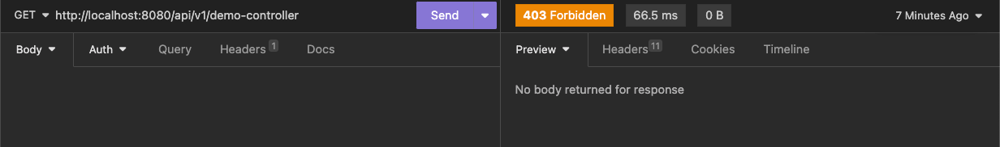
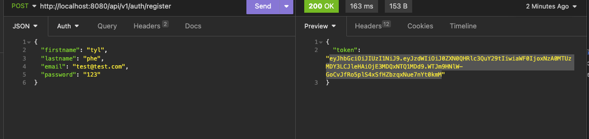
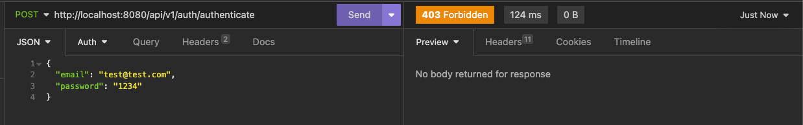
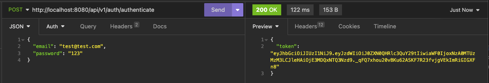
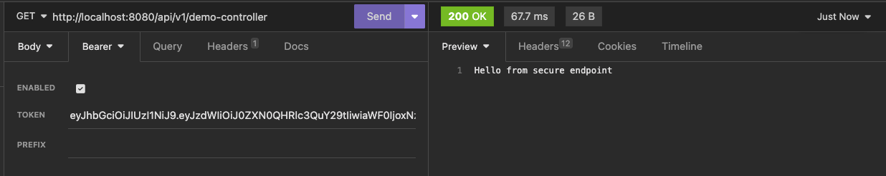

# Spring Boot Security

Learning about how to implement security in spring boot. Hoping this can be a weekend project.

### GET request without Authentication token
403 Forbidden

### Registering User

### Authenticate with wrong password

### Authenticate with correct password

### GET request with Authentication token
